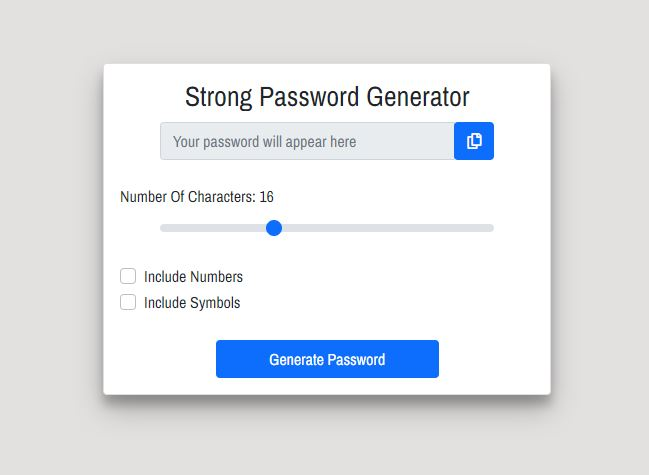

# Password Generator 

This application creates strong and random passwords 
for those trying to secure their computer and personal information. 

## Screenshot

## How To Use 

 - Choose the length of your password by dragging the slider. 
 - To include numbers and symbols in your password, click on the corresponding checkboxes. 
 - Click the "generate password" button, which will create a random password based on your selected options.
 - **PLEASE NOTE:** if you click the "generate password" button without including numbers and symbols, your password will only contain letters. 

## Technologies & Frameworks Used

- Bootstrap 5.0.2
- HTML
- CSS
- VanillaJS
